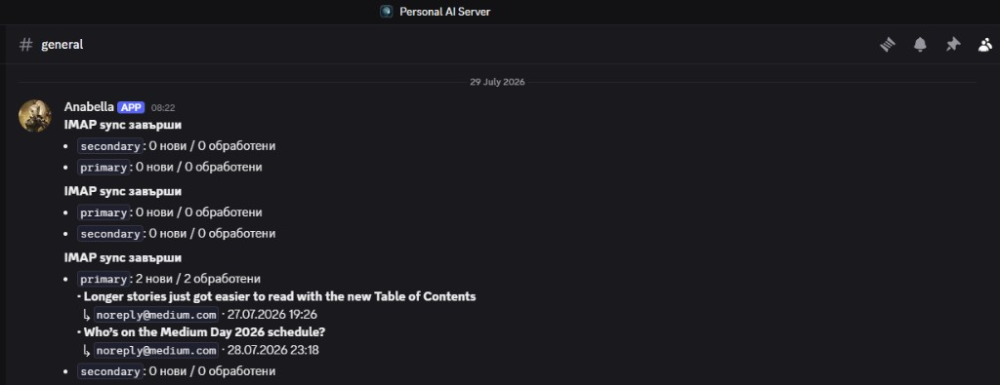
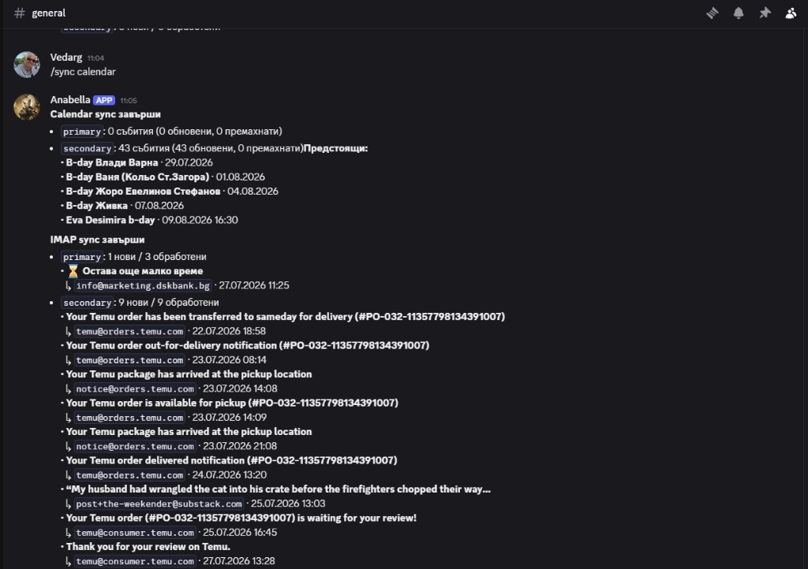
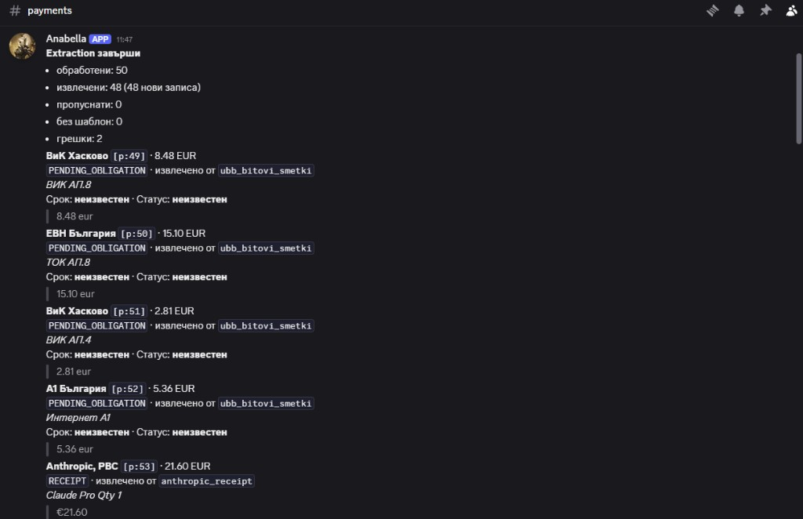
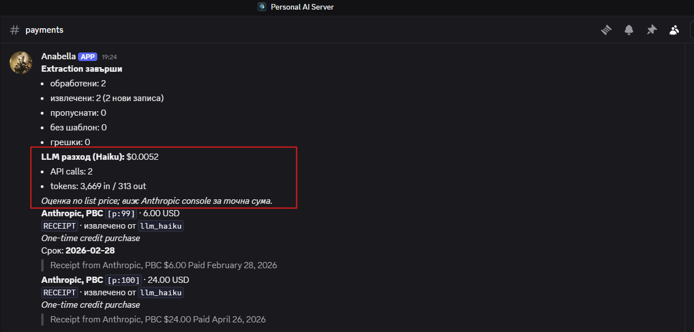
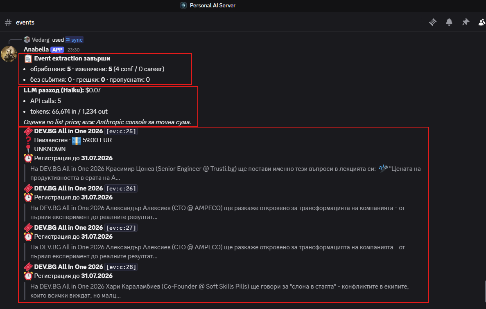

# Anabella - Discord AI Assistant

Personal Discord bot that ingests **Gmail accounts** (IMAP), syncs **Google Calendar** (secret iCal URL), and posts **verified payment extractions** to `#payments` and **conference/career events** to `#events` — **deterministic parsers first**, **Haiku LLM fallback** when templates miss, plus an **eval harness** to measure hallucination risk.

> Read-only by design: no outbound email, no payments, no calendar writes.

## Screenshots

### IMAP sync → `#general`

New mail from both Gmail accounts, posted after each sync.



### Calendar + IMAP sync (`/sync all`)

ICS upcoming events and new email summaries in one run.



### Payment extraction → `#payments` (templates, $0)

Deterministic parsers — UBB obligations and Anthropic receipts with evidence quotes.



### LLM fallback + cost report (Haiku)

When templates miss, Haiku extracts with verbatim validation; batch cost posted to `#payments`.



### Event extraction → `#events` (Haiku, B5)

DevBG / Udemy / LocalAGI emails → conference & career records with verbatim quotes, cost report, and slash-command reply in-channel.



## Why this project

Most “AI assistants” over email fail silently — wrong amounts, invented due dates, confident nonsense. Anabella inverts that:

1. **Gmail labels + sender routing** decide the pipeline (zero LLM cost for known formats).
2. **Template extractors** parse recurring bill formats (UBB utility table, Anthropic receipts).
3. **Haiku fallback** runs only when templates miss — with the same verbatim checks.
4. Every amount carries a **`evidence_quote`** copied exactly from the email body.
5. **`pytest -m eval`** tracks field-level precision/recall on deterministic extractors.

## Architecture (current)

```
Gmail (IMAP) ──► raw_messages (Postgres)
                      │
                      ▼
              extraction cascade
              JSON-LD → templates → Haiku (fallback)
                      │                    │
                      ▼                    └── token usage → cost estimate
              payment_records ──► Discord #payments

              event extraction (DevBG/Udemy/LocalAGI; manual /sync events)
              Haiku + citation validation
                      │
                      ▼
         conference_events / career_events ──► Discord #events

Google Calendar (ICS) ──► calendar_events ──► Discord #general
```

| Layer                                               | Status   |
| --------------------------------------------------- | -------- |
| Postgres 17 + pgvector, Alembic                     | ✅       |
| Multi-account IMAP sync (UID cursor, X-GM-MSGID)    | ✅       |
| Calendar ICS sync (ETag, RRULE expansion)           | ✅       |
| IMAP IDLE + notify only on new mail                 | ✅       |
| Calendar daily cron + sync on bot startup           | ✅       |
| Payment extraction — UBB & Anthropic templates      | ✅       |
| Eval harness (`tests/eval/`)                        | ✅       |
| LLM fallback — Haiku + verbatim validation          | ✅       |
| LLM cost report in `#payments` after each batch     | ✅       |
| Conference/career events → `#events` (B5)           | ✅       |
| Event citation validation (DevBG-tolerant matching) | ✅       |
| Vector memory — embed, chunk, index, search (C1.2)  | ✅       |
| Memory wiring + backfill (C1.3)                     | ✅       |
| Grounded chat + memory (Sonnet)                     | 🔜 C2–C3 |

## Extraction cascade

| Step          | When                                                  | Cost                        |
| ------------- | ----------------------------------------------------- | --------------------------- |
| **JSON-LD**   | Invoice markup in email                               | $0                          |
| **Templates** | Known senders (UBB, Anthropic receipt format)         | $0                          |
| **Haiku**     | Template matched but failed, or unknown payment email | ~$0.002/email               |
| **Failed**    | LLM rejected (bad quote) → alert in `#payments`       | billed tokens still counted |

After each extraction batch that used Haiku, `#payments` gets a summary like:

```
LLM разход (Haiku): $0.0052
- API calls: 2
- tokens: 3,669 in / 313 out
```

Estimate uses Anthropic list pricing ($1/M input, $5/M output for Haiku 4.5). **Anthropic console** on the `Anabella` API key is the source of truth for billing.

## Event extraction (B5)

Emails with Gmail labels **`DevBG`**, **`Udemy`**, or **`LocalAGI`** (plus sender hints like `@dev.bg`) run through a separate Haiku pipeline:

| Schema         | Fields                                                                     |
| -------------- | -------------------------------------------------------------------------- |
| **Conference** | name, dates, location, online/in-person, price, registration/CFP deadlines |
| **Career**     | type, company, position, dates, deadline, next step                        |

Each record requires an **`evidence_quote`** grounded in the email body. Generic newsletters with no concrete events return empty (no Discord noise).

**Citation validation** checks quotes against the same text Haiku sees (`message_body_for_llm`), with tolerant matching for real DevBG quirks:

- `\r\n` vs `\n`, collapsed whitespace
- tracking URLs `[https://…]` skipped in body
- Cyrillic/Latin homoglyphs (`Оnline` / `Online`)
- optional space before year (`One 2026` / `One2026`)
- minor name typos (fuzzy token match, ≥88% similarity)

If `price_raw` appears in the body but not inside the quote, the price is dropped and the event is still saved.

**Operational notes:**

- Event extraction does **not** run on IMAP startup — use **`/sync events`** (or **`/sync extract`** in `#events`).
- **`/sync events`** posts results in the **channel where you run the command** (replaces the “thinking…” defer message).
- **`/sync payments`** and **`/sync extract`** in `#payments` do the same for **payments only** (no events).
- Default batch: **5 newest** pending candidates per run (`EVENT_EXTRACTION_BATCH_SIZE=5`).
- LLM cost is reported in the same reply, like `#payments`.

```powershell
/sync payments        # payment extraction only → reply in current channel
/sync events          # event extraction only → reply in current channel
/sync extract         # in #payments → payments; in #events → events
/sync imap            # IMAP + payment extraction (not events)
/sync reindex         # backfill vector memory from all payment records
/sync all             # IMAP + calendar
```

**`/sync extract`** е alias: в `#payments` → bills/receipts; в `#events` → DevBG mail. Извън тези канали — подсказка да ползваш `/sync payments` или `/sync events`.

### Automatic sync (background)

| Source | When | Discord `#general` |
|--------|------|---------------------|
| **IMAP** | IMAP IDLE — при ново писмо | Само ако има нови имейли (или грешка) |
| **Calendar** | При старт на бота + веднъж дневно (`ICS_SYNC_HOUR` / `ICS_SYNC_MINUTE`) | При старт винаги; daily само при промяна в календара |
| **Payments** | След IMAP sync с нови имейли | `#payments` (extraction pipeline) |
| **Memory** | След успешен payment extract (нов record) | само в логовете |

Ръчно: `/sync imap` и `/sync calendar` винаги показват резултат. **`/sync reindex`** — пълен backfill на vector memory.

## Quick start (local)

**Prerequisites:** Python 3.11+, Docker Desktop, Discord bot app, Gmail app passwords, [Anthropic API key](https://console.anthropic.com) (for LLM fallback).

```powershell
# 1. Clone and configure
cp .env.example .env   # fill secrets — never commit .env

# 2. Database
docker compose up -d db

# 3. Python environment
python -m venv .venv
.\.venv\Scripts\Activate.ps1
pip install -e ".[dev]"

# 4. Migrations
alembic upgrade head

# 5. Verify Anthropic key (optional, ~$0.001)
python scripts/verify_anthropic.py

# 5b. Verify OpenAI embeddings + backfill existing payments (optional)
python scripts/verify_openai_embeddings.py
python scripts/backfill_memory.py

# 6. Run the bot (must stay running while you use Discord)
python -m assistant.main
```

### Required `.env` keys (minimum)

| Key                      | Purpose                                             |
| ------------------------ | --------------------------------------------------- |
| `DISCORD_*`              | Bot token, guild, channels, your user ID            |
| `FERNET_KEY`             | Encrypt Gmail passwords & ICS URLs in DB            |
| `ACCOUNT_*`              | Two Gmail IMAP accounts + labels                    |
| `DATABASE_URL`           | Postgres (local: `@localhost:5432`)                 |
| `ANTHROPIC_API_KEY`      | Haiku fallback extraction                           |
| `OPENAI_API_KEY`           | Payment memory embeddings (C1.3+)                   |
| `LLM_EXTRACTION_ENABLED` | `true` / `false` — disable LLM without removing key |

`OPENAI_API_KEY` е нужен за vector memory (auto-index след extract + `/sync reindex`). Sonnet е за C2 chat.

### Discord commands

| Command              | Action                                           |
| -------------------- | ------------------------------------------------ |
| `/ping`              | Health check                                     |
| `/sync` → `imap` | Email sync + payment extraction |
| `/sync` → `calendar` | ICS sync |
| `/sync` → `payments` | Payment extraction only (reply in current channel) |
| `/sync` → `extract` | In `#payments` or `#events` only (same as payments/events there) |
| `/sync` → `events` | Event extraction only (reply in current channel) |
| `/sync` → `reindex` | Backfill vector memory from all payment records |
| `/sync` → `all` | IMAP + calendar |

### How it works without VPS deploy

Discord hosts your server in the cloud. The bot is a **Python process on your machine** that connects **outbound** to Discord’s API. Docker locally only runs **Postgres**. When the bot is stopped, slash commands time out.

## Testing

```powershell
pytest              # unit tests (eval excluded)
pytest -m eval      # extraction quality harness (deterministic only, no API cost)
```

Eval thresholds: `pyproject.toml` → `[tool.assistant.eval]`.

## Project layout

```
src/assistant/
  ingest/              IMAP sync (Gmail X-GM-LABELS), ICS sync, MIME parsing
  extraction/
    templates/         UBB, Anthropic (deterministic)
    events/            conference/career Haiku pipeline (B5)
    citations.py       evidence quote matching (tolerant DevBG rules)
    llm_fallback.py    Haiku structured extraction (payments)
    llm_cost.py        token usage + USD estimate
    pipeline.py        payment cascade orchestration
  memory/              embeddings, chunks, index, search (C1)
  discord_bot/         client, slash commands, formatting
  scheduler/           periodic sync + Discord notify
docs/
  screenshots/         README screenshots (incl. events-extraction.png)
scripts/
  verify_anthropic.py  one-shot Anthropic API key check
  verify_openai_embeddings.py  one-shot OpenAI embedding check
tests/
  fixtures/emails/     anonymized samples
  eval/                manifest-driven extraction eval
```

## Security

- **Do not commit `.env`** — bot token, Gmail app passwords, calendar secret URLs, Fernet key, API keys.
- Copy `.env.example` only; set `POSTGRES_PASSWORD` locally.
- **`docker-compose.yml` has no embedded passwords** — credentials live only in `.env`.
- Email fixtures are **anonymized** (synthetic names, redacted Stripe links).
- Bot uses a **Discord user ID allowlist**.
- Use a **dedicated Anthropic API key** (`Anabella`) to isolate cost in the console.

If GitGuardian flags old commits with `assistant:assistant` in compose — those were local dev placeholders, not production secrets. Mark resolved; rotate only if a real token was committed (`.env` was never in git).

## Roadmap

- **C1** — Vector memory (OpenAI embeddings)
- **C2** — Grounded Q&A in `#chat` (Sonnet)
- **C3** — Evening journal

## License

Private / all rights reserved unless otherwise noted.
